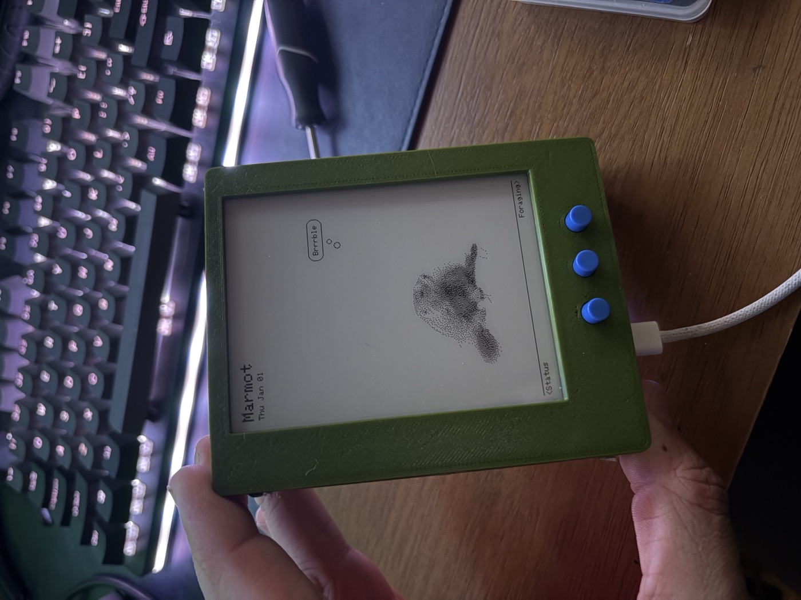

# Forager

A battery-powered e-ink shelf artifact: a foraging tamagotchi. A hoary
marmot lives on the display, born the first time you power it on, and grows
up as you feed it real Pacific Northwest species — reflecting real Seattle
weather/season and what's worth foraging right now. It sleeps almost all
the time; ENTER wakes it, it refreshes, and it drops back to deep sleep
after 60s idle. Neglect it for about a week and it dies.

<p align="center">
  
</p>

## Getting started

```sh
cp include/secrets.example.h include/secrets.h   # fill in WiFi networks
~/.platformio/penv/bin/pio run -t upload          # build + flash
```

Wire the hardware per the pin map below, then press ENTER. First-ever wake
runs a birth sequence and prompts you to name the marmot.

## Hardware

| Part | Detail |
|------|--------|
| MCU | ESP32-S3 Super Mini (onboard LiPo charging via USB-C) |
| Display | Waveshare 4.2" e-ink, 400×300 physical / 300×400 logical portrait, SPI, 1-bit (official `epd4in2_V2` driver) |
| Buttons | 4× tactile (LEFT / RIGHT / ENTER / SETTINGS) |
| Battery | LiPo 3.7V, soldered to BAT+/BAT- |
| Power switch | SPST slide switch inline on BAT+ |

| Signal | GPIO |
|--------|------|
| E-ink SCK / MOSI / CS / DC / RST / BUSY | 12 / 11 / 10 / 9 / 8 / 7 |
| ENTER (deep-sleep wake) | 4 |
| SETTINGS | 5 |
| LEFT / RIGHT | 1 / 2 |

LEFT/RIGHT/ENTER read `INPUT_PULLDOWN`, active-HIGH, and wake the board from
deep sleep (`esp_sleep_enable_ext1_wakeup`, ANY_HIGH); ENTER needs an
RTC-capable GPIO. SETTINGS rides the display module's own KEY1 button
instead — wired switch-to-GND (`INPUT_PULLUP`, active-LOW, opposite polarity
from the rest) and not a wake source, so Settings only works once awake.

## Behavior

- **Sleep/wake**: deep sleep between interactions (screen holds its image at
  zero power); ENTER wakes it, or a 24h timer backstop. On wake: WiFi → NTP
  → weather → recompute mood/growth/death → check for an event → render.
- **Growing up**: three stages (Baby / Juvenile / Adult) based on distinct
  species eaten, not elapsed time. Species only appear in the Foraging list
  once discovered via a wake-time event.
- **Staying alive**: Hunger, Happiness, and Energy are persisted bars that
  each decay over about a week without feeding/interaction; any one maxing
  out (Hunger) or bottoming out (Happiness/Energy) kills the marmot and
  resets to a fresh birth.
- **Views** (LEFT/RIGHT cycle, ENTER acts): Minigames ← Status ← **Main**
  → Foraging. Main shows the marmot + mood + weather + pending events;
  Foraging pages the discovered species list and eats on ENTER; Status shows
  the raw stats.
- **Minigames**: five turn-based games, unlocked as the marmot grows and the
  journal fills — Snack Hunt and Marmot Says (from birth), Forest Memory
  (Juvenile), Burrow Maze (Adult), and Species Quiz (50 species discovered).
  Nothing here is scored on reaction time; the panel refresh makes that
  unplayable, so every game is one that was always turn-based. Each keeps a
  persisted high score, a scoring run bumps happiness once per wake, and
  crossing an unlock threshold shows a one-time reveal screen.
  - **Snack Hunt** — four bushes, rummage under one; every bush shifts aside
    afterward so you see what you walked past. Five picks a run. Under a bush
    there might be stash material (dry grass, leaves, wood, a wildflower),
    nothing at all, a harmless critter, or — rarely — a predator, which ends
    the run early. Nothing already banked is ever lost; the cost is the rest
    of the day's picks.
  - **Marmot Says** — Simon: repeat a growing LEFT/RIGHT/ENTER sequence.
  - **Forest Memory** — concentration on a 4×3 grid of forest tokens, with a
    miss budget.
  - **Burrow Maze** — a 5×5 tunnel dig. Three buttons can't steer in four
    directions, so it never asks for one: at each junction it lists the
    tunnels out of that cell, LEFT/RIGHT cycle them, ENTER commits, and the
    marmot walks the whole corridor by itself. One press per *decision*.
  - **Species Quiz** — name a species from a clue, photo revealed on a right
    answer.
- **Winter Stash**: what Snack Hunt turns up (dry grass, leaves, twigs, the
  odd wildflower — den-stuffing, deliberately not foraging species)
  accumulates in a persisted stockpile across days. **Only the first run of
  each calendar day stocks it**; later runs still play and still score, they
  just don't gather, so the season's goal can't be ground out in one sitting.
  Reach 120 points before December and the marmot dens up fat and content;
  fall short and it goes into winter hungry — unless it was born within 60
  days of winter, in which case it's let off, since it never had a season to
  gather in. Settled once on the first December wake, then cleared for the
  next year. Progress shows on the Status view as well as in the game.
- **Wake-time events**: roughly every 6h of wall-clock time, a chance of a
  Discovery/sighting/find/mishap/weather/treasure/encounter event takes over
  the Main view until resolved. Frequent use raises the odds; browsing all
  views quickly guarantees one.
- **Settings** (via SETTINGS button): Achievements (Adult only; 9 unlockable
  badges), WiFi Networks (add/remove, on-screen keyboard), Reset Game (wipes
  progress, confirm required), Power Off (true off, confirm required).

See `CLAUDE.md` for implementation details (NVS layout, display driver
quirks, hardware gotchas, art-sourcing pipeline) not covered here.

## Data sources

- **Time**: NTP, no RTC module, Pacific time with DST.
- **Weather**: [wttr.in](https://wttr.in) JSON for Seattle.
- **Foraging reference**: 200 PNW species (`src/foraging/foraging_species.h`),
  most paired with a real sourced photo.
- **Quiz clues**: a separate 322-entry bank covering all 200 species
  (`src/minigames/quiz_facts.h`), written apart from the reference text so
  the quiz isn't quoting a card you can page over to. 115 species carry two
  or more clues, so meeting a familiar one again isn't the same question.
- **Animal sightings**: 25 PNW animals, 21 with a real photo.
- **Achievement badges**: 9 flat icons from openly-licensed Commons sets.

## Build / Format / Lint

```sh
~/.platformio/penv/bin/pio run                                        # build
~/.platformio/penv/bin/pio run -t upload                              # flash
~/.platformio/penv/bin/pio device monitor                             # serial @ 115200
clang-format -i $(find src include -name '*.cpp' -o -name '*.h' | grep -v epd_official)
~/.platformio/penv/bin/pio run -t compiledb && clang-tidy ...         # against src/, excluding epd_official/
```

Or use the PlatformIO IDE extension in VSCode (`.vscode/extensions.json`).
